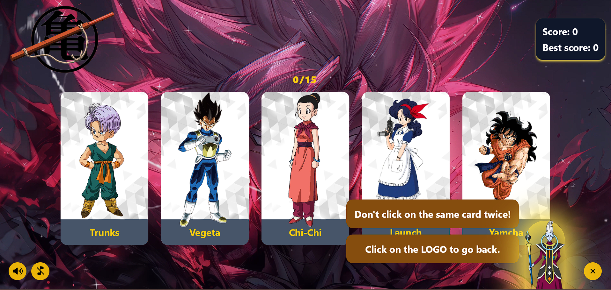

# Memory Card Game

Welcome to the **Memory Card Game** featuring the iconic characters from the legendary anime **Dragon Ball**! This is a fun and interactive memory game. The game includes different levels of difficulty, customizable sound effects, and exciting hover effects on each card.

;

## Features

- **Dragon Ball Characters**: Play with the most famous characters from the Dragon Ball universe.
- **Difficulty Levels**: Choose from three difficulty levels - Easy, Medium, and Hard.
- **Customizable Sound**: Enable or disable sound effects as per your preference.
- **Interactive Hover Effects**: Enjoy smooth and engaging hover effects when you interact with each card.
- **Responsive Design**: Optimized for all devices, ensuring a seamless experience on both desktop and mobile.

## Built With

- **React**: A JavaScript library for building user interfaces.
- **Tailwind CSS**: A utility-first CSS framework for rapid UI development.
- **FontAwesome**: Icons and styling for interactive elements.
- **JavaScript**: The core logic for the game is implemented in JavaScript.

## Installation

To run this project locally, follow these steps:

1. **Clone the Repository**

```
git clone https://github.com/hieuhocit/memory-card.git
```

2. **Navigate to the Project Directory**

```
cd memory-card
```

3. **Install Dependencies**

```
npm install
```

4. **Run the Development Server**

```
npm run dev
```

5. **Build for Production**

```
npm run build
```

## Author

This project is developed by [@hieuhocit](https://github.com/hieuhocit).
